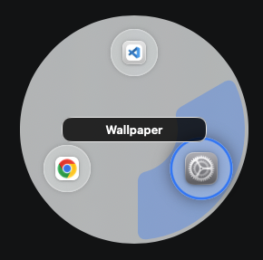
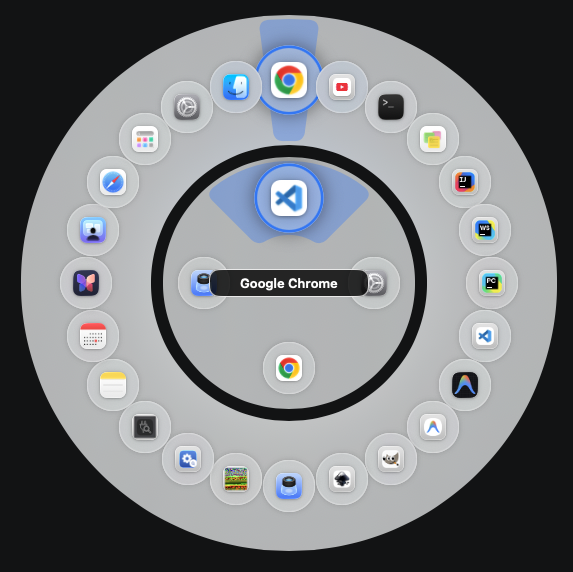

# Window Ring

A menu-bar utility that replaces ⌘Tab/Dock/Mission Control with a **radial**
switcher. Press a shortcut and a ring of your open windows appears centered on
the mouse cursor; point at one and confirm. Press the shortcut again and a
second, outer ring appears — a radial replacement for the Dock, listing your
pinned and running applications.

Every entry in the inner ring is an individual **window**, not an application —
three Safari windows show up as three separate ring entries.



Every entry in the outer ring is an **application** to launch or switch to.




The ring is a *mode*, not a hold-to-preview gesture: it stays on screen after
you let go of the shortcut, so you can drive it with the mouse or entirely from
the keyboard, at whatever pace you like.

## Requirements

- macOS 26 (Tahoe) — this is the only OS the project targets/was tested on.
- Xcode 26+.
- [XcodeGen](https://github.com/yonaskolb/XcodeGen) (`brew install xcodegen`) to (re)generate `WindowRing.xcodeproj` from `project.yml`. The generated `.xcodeproj` is not checked in — run `xcodegen generate` once before opening the project, and again any time `project.yml` or the file layout changes.

## Build & run

```sh
brew install xcodegen   # if you don't already have it
cd WindowRing
xcodegen generate
open WindowRing.xcodeproj
```

Build and run the `WindowRing` scheme (⌘R). The app has no Dock icon
(`LSUIElement`); look for its icon in the menu bar.

Or from the command line — pass `-derivedDataPath DerivedData` so the build
lands inside the project folder (`DerivedData/`, already gitignored) instead
of Xcode's global DerivedData cache:

```sh
xcodebuild -project WindowRing.xcodeproj -scheme WindowRing -configuration Debug -derivedDataPath DerivedData build
open DerivedData/Build/Products/Debug/WindowRing.app
```

## First run: granting Accessibility

On launch, Window Ring immediately requests **Accessibility** access. This is
the *only* permission it needs, and it's required for three specific things:

1. Reading window titles and minimized state via the Accessibility (AX) API.
2. Detecting the global shortcut, and reading ring keyboard/scroll input, via
   a `CGEventTap`.
3. Raising/activating the window you point at.

If you dismiss the prompt or need to grant it later: **System Settings →
Privacy & Security → Accessibility**, enable **WindowRing**. The app polls
`AXIsProcessTrusted()` every 2 seconds, so it starts working within a couple
of seconds of granting — no relaunch needed. Until granted, the app runs (menu
bar icon, Preferences) but the shortcut does nothing, and the settings window
shows an "Accessibility access required" banner with a button that deep-links
straight to that Settings pane.

> **You must re-grant Accessibility after every rebuild.** The project uses
> Xcode's ad-hoc "Sign to Run Locally" signature, which is *different on every
> build*. macOS keys the Accessibility grant to the signature, so a rebuilt
> binary is a stranger to TCC — and it revokes the grant silently, with no new
> prompt, so the app just stops responding to the shortcut. The fix is to
> toggle WindowRing off and back on (or remove and re-add it) in that Settings
> pane after each build. Setting up a stable local signing identity would end
> this cycle; that work isn't done yet.

Window Ring cannot run inside the App Sandbox — AX APIs and system-wide event
taps are unavailable to sandboxed processes — so it can't be Mac App
Store–distributed. That's an accepted tradeoff for a personal utility like
this, and the project is unsandboxed by design (no entitlements file at all).

## Using it

### The window ring (inner)

- **Tap Right Option (⌥)** anywhere — press and release it without touching
  anything else, and the ring appears at your cursor, showing your windows
  ordered most-recently-used first, with the active app at the top of the ring
  (12 o'clock). It's a *tap*, not a hold: the ring opens on release and then
  stays up until you confirm or cancel.
- **⌥e still types é.** Because the shortcut only fires on a clean release, any
  other key or a mouse click during the hold cancels it, so using Right Option
  as the dead-key modifier it also is never opens the ring.
- **Move the mouse** toward a window to select it: its wedge highlights, its
  icon grows, and its title appears in the ring's center hub. **Scrolling**
  rotates the selection too.
- **Press 1–9** to jump straight to that item and activate it, counting
  clockwise from the top. There's no badge on the icons saying so — the numbers
  cluttered every item to advertise something worth learning once.
- **Confirm** with **Return**/**Enter**, or by **clicking anywhere on the
  ring**. The window unminimizes/unhides if needed, comes to the front, and
  macOS switches Spaces automatically if it's on another one.
- **Cancel** with **Escape**, or by **clicking outside** the rings (including
  the transparent area inside the overlay, or any other app's window). Either
  one hides every ring at once — nothing is activated.

### The app ring (outer) — a radial Dock

- **Tap Right Option again** while the window ring is up: a second, outer
  ring appears listing your **applications** — everything pinned in your real
  Dock (read from `com.apple.dock`'s `persistent-apps`), plus any running app
  that isn't pinned.
- While it's open, the outer ring owns selection: the mouse and the arrow/Tab
  keys drive it, and the center hub shows *its* selected app's name. The
  selection wedge spans the outer ring's full radial thickness, because the
  whole band is the button.
- **Confirm** launches the app if it isn't running, or activates it (unhiding
  first if needed) if it is.
- **A third tap** collapses the outer ring, leaving the window ring up. A
  **fourth** dismisses everything.
- **Escape** and clicking outside always dismiss *everything* at once, from
  either ring.

### Keyboard navigation

| Key | Action |
|---|---|
| Right Option (default shortcut) | Open the window ring → open the app ring → collapse the app ring → dismiss |
| → or Tab | Select the next item clockwise |
| ← or Shift-Tab | Select the next item counter-clockwise |
| Scroll down / up | Select the next item clockwise / counter-clockwise |
| 1–9 | Select that item and confirm immediately |
| Return / Enter | Confirm the selection |
| Escape | Dismiss every ring, activating nothing |
| Anything else | Dismiss the ring, and the keystroke goes to the app underneath |

Arrow and Tab keys work on their own — you do **not** hold the shortcut while
navigating.

**The ring never takes keyboard focus.** The overlay panel deliberately can't
become key; the keys above are picked off by the event tap and swallowed, and
every other keystroke passes straight through to whatever app you were working
in (dismissing the ring on the way). So an open ring can't strand your
keyboard, and typing is always a way out of it.

### Other behavior

- If there are no eligible windows, nothing appears — the ring never flashes
  empty.
- **Finder is excluded when it has no windows open.** Finder always publishes
  the desktop in its AX window list, so it would otherwise appear permanently
  as a phantom "Finder" entry (see Known macOS limitations).
- The shortcut never interferes with ⌘Tab, Mission Control, or anything else:
  the event tap consumes nothing unless a ring is actually on screen.

## The ring's visual design

Each ring is a single frosted-glass annulus (`.thickMaterial`), drawn as one
shape so there's no seam between adjacent items. Only the **selected** item
draws a wedge — a translucent accent fill with rounded corners, inset 4pt on
all four sides so a transparent border separates it from its neighbours and
from the ring's own edges. The inset is *arc-length uniform*: both radii pull
in 4pt, and each radial edge pulls in by the angle covering 4pt at that edge's
own radius, so the margin measures 4pt everywhere rather than being wide at the
outer edge and thin at the inner one.

Each item's wedge spans exactly 360°/n. Titles are not drawn per-item — only
the selected item's title appears, once, in the center hub, which keeps a
crowded ring readable and lets long titles have real width.

## Changing the shortcut

Click the menu-bar icon → **Preferences…** → **Change…** next to the
shortcut, then press and release the modifier key(s) you want (e.g. hold
⌃⌥ together, then let go). Whatever you pick is triggered by *tapping* it —
pressing and releasing with nothing else touched in between. The recorder only needs to see your own
Preferences window get the keystrokes — no extra permission beyond the
Accessibility grant above.

Preferences also let you:
- **Launch Window Ring at login.**
- Include/exclude minimized windows.
- Include/exclude hidden applications.
- Set how many windows the ring shows at most (3–12, default 8).

Ordering policy is fixed to most-recently-used in this version (see
Architecture below for how to add more).

## Architecture

One Xcode app target, no third-party dependencies, SwiftUI app lifecycle +
AppKit/Core Graphics/Accessibility where SwiftUI alone isn't enough for
reliable global shortcut/overlay/window-activation behavior.

| File | Responsibility |
|---|---|
| `WindowRingApp.swift` / `AppDelegate.swift` | App entry point, `MenuBarExtra` status item, wires everything together, owns the Preferences window. |
| `WindowModel.swift` | `WindowInfo` (one ring item) and `WindowIdentity` (stable, hashable identity wrapping an `AXUIElement`). Both rings use `WindowInfo` — for the app ring it describes an application rather than a window. |
| `WindowDiscovery.swift` | Enumerates individual windows via the Accessibility API. |
| `DockDiscovery.swift` | Builds the outer ring's app list: the real Dock's `persistent-apps` from the `com.apple.dock` preference domain, plus unpinned running apps, each with a launch URL. |
| `WindowMRUTracker.swift` | Builds most-recently-focused-window history via `AXObserver`. |
| `WindowOrdering.swift` | `WindowOrderingPolicy` protocol; `MRUOrdering` is the only policy implemented. |
| `RadialLayout.swift` | Pure geometry: item placement around a circle, nearest-item hit-testing from a mouse point, global↔view coordinate conversion. No AppKit dependency. |
| `RadialOverlayWindow.swift` | Borderless, non-activating `NSPanel` hosting both ring layers. Never becomes key; forwards clicks to `RingController`. |
| `RadialRingView.swift` | SwiftUI ring UI: `RadialRingContainerView` composes both ring layers plus the shared center label; `WedgeShape` (inset, rounded-corner pie slice) and `AnnulusShape` do the drawing. |
| `RingSessionState.swift` | Live per-ring state (item list, geometry, selected index) driving the SwiftUI view. One instance per ring. |
| `RingController.swift` | Orchestrates a session across both rings: open, promote, collapse, confirm, dismiss. |
| `GlobalShortcut.swift` | `CGEventTap` that detects a clean *tap* of a configurable modifier combo, and routes keyboard/scroll events to the ring, consuming the ones it handles. |
| `WindowActivation.swift` | Un-minimize/un-hide/activate/raise sequence for the selected window. |
| `PermissionsManager.swift` | Accessibility-trust check, prompt, polling, and deep link to System Settings. |
| `Preferences.swift` / `PreferencesView.swift` | UserDefaults-backed settings + the settings window, including the shortcut recorder. |
| `VirtualKey.swift` | Hardcoded standard virtual keycodes for modifier keys, Escape, Return/Enter, arrows, and Tab (no Carbon import needed). |
| `DebugLog.swift` | `os.Logger` wrapper that marks messages `privacy: .public`. |

### Why `DebugLog` exists

Swift's `NSLog` passes the whole formatted message as a private `%@` argument,
so everything it logs shows up in Console and `log show` as `<private>` — which
makes it useless for diagnosing this app, where most of the interesting state
lives in the message text. `debugLog(_:)` uses `Logger` with an explicit
`privacy: .public` instead. To watch it:

```sh
log show --predicate 'process == "WindowRing"' --last 5m | grep '\[WindowRing\]'
```

## macOS APIs used, and why

- **Accessibility (AX) API** (`AXUIElementCreateApplication`,
  `AXUIElementCopyAttributeValue`, `AXUIElementPerformAction`, `AXObserver`)
  for window enumeration, titles, minimized state, raising, and MRU tracking.
  Chosen over `CGWindowListCopyWindowInfo` specifically to *avoid* needing
  Screen Recording permission — since Catalina, that CG API redacts window
  titles for other processes unless the caller has screen-recording access,
  while the AX API gives titles with just Accessibility trust.
- **`CGEventTap`** (session-level, `.defaultTap`) for detecting the global
  shortcut and for all ring keyboard/scroll input. It consumes an event *only*
  while a ring is on screen and *only* for the keys the ring itself acts on;
  with no ring up everything passes through untouched, so ⌘Tab and other system
  shortcuts are unaffected. An `NSEvent` global monitor was not an option here
  because monitors cannot consume: Return would confirm the ring *and* land in
  the app underneath.
- **`NSEvent.addGlobalMonitorForEvents`** for the two things while a ring is
  shown that don't need consuming: `.mouseMoved` to track the cursor, and
  `[.leftMouseDown, .rightMouseDown]` to catch clicks outside the overlay.
- **`UserDefaults(suiteName: "com.apple.dock")`** to read the real Dock's
  `persistent-apps` list, so the outer ring mirrors the Dock the user actually
  arranged.
- **`NSWorkspace.openApplication(at:configuration:)`** to launch apps from the
  outer ring, and **`NSRunningApplication`** for app icons, unhide, and
  app-level activation.
- **`SMAppService.mainApp`** for the launch-at-login toggle. The state lives in
  launchd, not UserDefaults, and is re-read every time Preferences opens — the
  user can remove the login item from System Settings without telling us.
- **`NSPanel` with `.borderless, .nonactivatingPanel`** for the overlay, with
  `canBecomeKey` forced to false so it can receive clicks without ever
  activating Window Ring or pulling focus off the frontmost app. Its content
  view overrides `acceptsFirstMouse` so the first click confirms rather than
  being spent activating the panel.
- **`NSScreen`** to find which display the cursor is on and clamp the overlay
  inside that display's visible frame, handling multi-monitor setups and
  per-display scale factors (handled automatically by AppKit).

No private APIs are used anywhere. The one deliberately-scoped heuristic is
noted in `GlobalShortcut.swift`: distinguishing left vs. right modifier keys
combines a flagsChanged event's keycode with its (side-agnostic) CGEventFlags
mask — correct for the single-key-per-family combos the shortcut recorder
produces, with a documented edge case if both the left and right key of the
same family were somehow held at once (not reachable through the UI).

## Implementation notes worth knowing

Two bugs here were subtle enough that the reasoning is recorded in the code,
and worth flagging for anyone changing the relevant files:

- **Angle wraparound in hit-testing** (`RadialLayout.nearestIndex`). `atan2`
  returns angles in (−π, π], but ring placement angles run from −π/2 up to
  nearly −π/2 + 2π. So `abs(pointAngle − placement.angle)` can exceed 2π, and
  the usual `if delta > π { delta = 2π − delta }` correction then yields a
  *negative* delta — which beats every real distance and lets the highest-index
  placements win unconditionally. The symptom was a mouse dead zone across the
  entire north-west arc of the outer ring. The difference must be reduced into
  [0, 2π) *before* the π check. The size of the broken arc scales with item
  count, which is why only the item-dense outer ring showed it.
- **Nothing slow may run inside the event-tap callback.** Opening a ring does
  a full AX sweep of every running app, and confirming activates a window over
  AX. Run either inline in the tap callback and macOS will eventually decide
  the tap is unresponsive and disable it (`kCGEventTapDisabledByTimeout`),
  silently killing the shortcut. `RingController` therefore hops to the main
  queue before doing any of that work, while still returning the
  consume/pass-through decision to the tap synchronously.
- **Distinct synthetic pids in `DockDiscovery`.** `AXUIElementCreateApplication`
  called with the same pid twice returns elements that compare `CFEqual`, so
  using a single placeholder pid (e.g. `0`) for every not-yet-running pinned
  app made them all collide as one `WindowIdentity` — a hard crash in
  `Dictionary(uniqueKeysWithValues:)`. Each non-running entry gets its own
  decrementing negative pid instead.

## Known macOS limitations

- **Space-switching on activation** depends on the user's own System Settings
  → Desktop & Dock → Mission Control setting "When switching to an
  application, switch to a Space with open windows." Window Ring just raises
  the window; if that setting is off, macOS may not switch Spaces
  automatically. This is standard system behavior, not a bug in Window Ring.
- **Finder always publishes the desktop** in its `kAXWindowsAttribute` — as an
  `AXScrollArea` with *no* subrole at all, not an `AXWindow`. Window discovery
  therefore checks the AX **role** before falling back to the lenient
  "no subrole is fine" rule that exists for older Java/cross-platform toolkits;
  without that role check, Finder appears in the ring permanently even with
  every Finder window closed.
- **Some apps omit AX subrole/title data**, which can make a window's title
  fall back to just the app name.
- **Mac App Store distribution isn't possible** — App Sandbox is incompatible
  with the AX/event-tap APIs this app depends on.
- **A window with an empty AX title** shows its app's name instead so the
  ring is never confusing; app icon + partial title should usually be enough
  to tell windows apart at a glance regardless.
